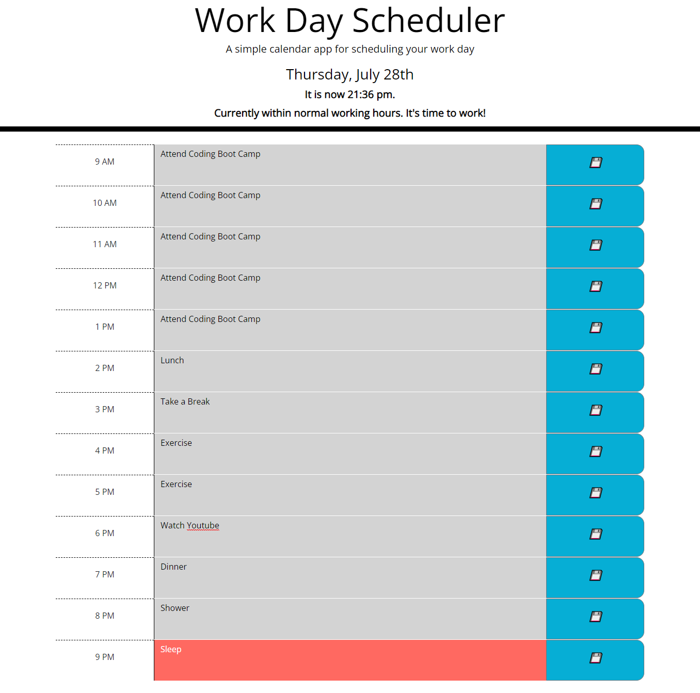
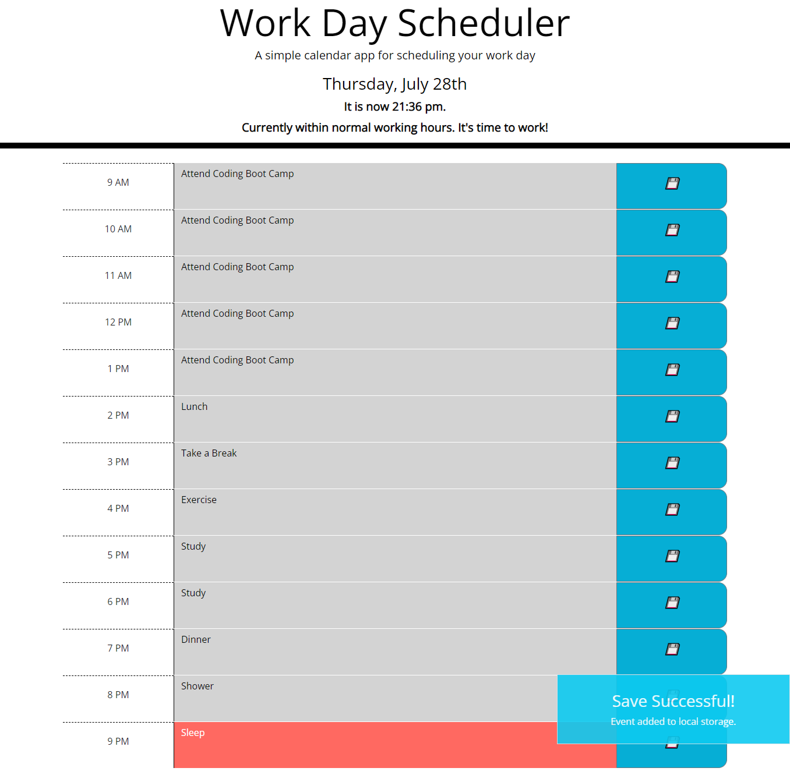

# work-day-scheduler

## Description

This project is a work day scheduler that allows a user to create events throughout the current day and save them locally for future reference. This project was built to demonstrate the capabilities of CSS Bootstrap, Jquery, Jquery UI, and moment.js libraries. 

## Procedure and Challenges

This project began with provided starter code that included the heading and some CSS classes. I began with writing a function in javascript using moment.js to show the date and time in the header. While not in the project specifications, I included to time as it will help identify what hour the scheduler should display currently.

Next, I hard-coded the container with all the time blocks and added times from 9 AM to 9 PM. Later on, I took these time blocks and created a function that generates all of them in a for loop. The number of time blocks and their time values are hard coded in, but the HTML is much cleaner. A more sophisticated solution would require a user input to define how long their work days are, at what time the day starts and ends, and then generate the variables based on that; however, while I tried to implement it, this idea could not be added in time.

Then, the time blocks were given color styled based on the current time. I looped through each description block, setting them to past, present, or future classes based on the current time. This changes the color and styles of the text input area. This function also gets the local storage value of the time and previously saved text inputs and adds them to the text input area.

Next, I added functionality to the save button by letting it store values in local storage. The storeTask function uses event delegation to select just the save buttons, and then get the content of the text input and current hour using DOM traversal. The hour associated with the text is stored as the key, while the text input is stored as the value in local storage. Then, I implemented a show/hide function from Jquery UI, allowing feedback for when something saved to local storage through the show() method.

## Testing

Various times have been tested and the application works to show whether the 9 AM-9 PM times are in the future or the past. 

A user can input anything into the text input boxes and it will save them to local storage when the user presses the save button. Empty inputs are saved as empty strings. Text inputs that currently do not have a local storage entry are given an empty string for storage so that unsaved inputs do not persist on reload.

## Screenshots

* Scheduler, with a full schedule

* Local Storage Saving Feedback

## Credits

Credit to https://jqueryui.com/show/ for demonstrations and code for showing and hiding an object.

## Github Deployed Site Link and Repository Link

GitHub Repository: https://github.com/voravichs/work-day-scheduler

GitHub Pages Deployment: https://voravichs.github.io/work-day-scheduler/

